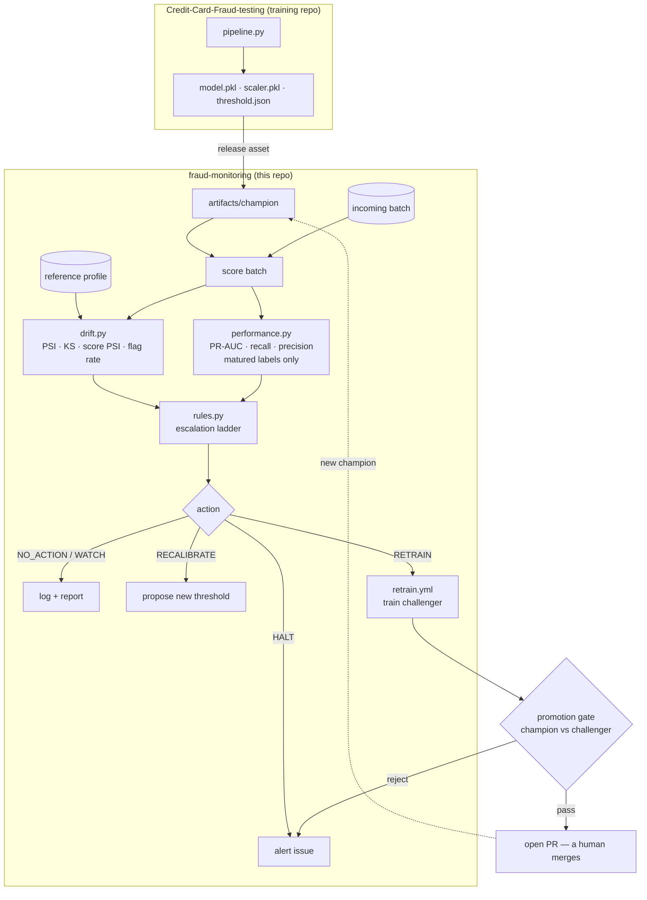

# fraud-monitoring

Drift detection, performance monitoring, and retraining policy for the credit-card
fraud model built by
[Ananya's Credit-Card-Fraud-testing](https://github.com/Koneko1625/Credit-Card-Fraud-testing).

Fraud model is forked to [Fong Fang Te's Credit-Card-Fraud-testing](https://github.com/Spooky757/Credit-Card-Fraud-testing) and 
added release.yml into its workflow.

This repo is regards to the monitoring and retraining of the model

---

## What it does



Two detection layers for whether we have the fraud labels or not

- **Unsupervised** (every batch, no labels): per-feature PSI + KS against a frozen
  reference profile, plus score-distribution PSI and flag rate. Catches covariate,
  prior, and data-quality problems within hours.
- **Supervised** (matured batches only): PR-AUC, recall, precision against the
  champion's promotion-time baseline. The only thing that catches **concept drift** —
  where the inputs look perfectly normal and the model is quietly wrong.

And one escalation ladder that converts those into exactly one action:

```
NO_ACTION → WATCH → RECALIBRATE_THRESHOLD → RETRAIN
                                    HALT (data quality — short-circuits everything)
```

---

## See it work in 60 seconds

This demo trains a stand-in champion on synthetic data and
walks a healthy batch, a drifted batch, and a concept-drift batch through the loop.

```bash
pip install -r requirements.txt
make demo
```

```
batch         PSI feats  max PSI   recall    decision                note
----------------------------------------------------------------------------------
healthy-1     0/29       0.001     0.900     WATCH                   same population
healthy-2     0/29       0.002     0.930     NO_ACTION               still healthy
covariate-1   8/29       1.276     0.950     WATCH                   8 features shifted
covariate-2   8/29       1.266     0.980     RECALIBRATE_THRESHOLD   confirmed — recalibrate threshold
concept-1     0/29       0.001     0.270     RETRAIN                 inputs normal, labels rewired
concept-2     0/29       0.001     0.290     RETRAIN                 confirmed concept drift
```

The table shows the design concepts of the model:

- When the system is **first** alerted the system doesnt act first. It goes to `WATCH`
  pending confirmation and streak number goes up +1.
- **Covariate drift** lights up 8 of 29 features but PR-AUC holds, so the system
  recalibrates the threshold instead of burning hours on a retrain.
- **Concept drift** shows `0/29` features drifting and recall collapsing from 0.98 to
  0.27.

Refer to `monitoring/reports/covariate-2.html` — a self-contained report with no CDN
calls, so it opens from a downloaded workflow artifact on a laptop with no network.

---

## Running it for real

### 1. Get the champion

```bash
mkdir -p artifacts/champion
# From the training repo's pipeline output:
cp ../Credit-Card-Fraud-testing/models/{model.pkl,scaler.pkl,threshold.json} artifacts/champion/
echo "v1.0.0" > artifacts/champion/VERSION
```

In CI the workflows pull these from the training repo's **release assets** workflow instead. Set
the repo variable `TRAINING_REPO` if yours differs from the default.

### 2. Freeze the reference profile

```bash
make reference   # or: python -m fraud_monitoring.cli build-reference --training-data data/raw/creditcard.csv
```

This reference profile records the distribution the champion was
*trained on* — bin edges, expected mass per bin, and the promotion-time baseline
metrics. Drift is measured against it forever after.

> **Re-run this every time you promote a new model.** A stale profile measures the new
> champion against the old champion's past, which produces confident nonsense. The
> monitor warns when `model_version` and the profile disagree, but it cannot fix it.

### 3. Monitor a batch

Go to the action tab and run the "monitor.yml" workflow or use the code

```bash
make monitor BATCH=data/incoming/2026-08-14.csv ENV=prod
```

This writes a JSON report (machine-readable), an HTML report (human-readable), updates the
state file, and prints a Markdown summary for the monitoring.

### 4. Let CI do it

| Workflow | Trigger | What it does |
|---|---|---|
| `ci.yml` | push / PR | pyflakes + pytest on 3.10–3.12 + CLI smoke test |
| `monitor.yml` | daily 02:00 UTC, or manual | one monitoring window; commits state; opens an issue on RETRAIN / HALT / RECALIBRATE |
| `retrain.yml` | monthly, called by monitor, or manual | trains a challenger via the training repo's own pipeline, gates it, opens a promotion PR |

`monitor.yml` commits `monitoring/state/` back to the repo. That is not incidental —
the state file holds the confirmation streak, and it is the only thing that makes
"two consecutive windows" mean anything across otherwise-stateless workflow runs.

---

## Wiring the two repos together

The files required for compatibility between the repos is three files.

| Artifact | Written by | Read by |
|---|---|---|
| `model.pkl` | `fraud_pipeline.inference.save_inference_artifacts()` | `artifacts.load_champion()` |
| `scaler.pkl` | same | same — **loaded, never re-fit** |
| `threshold.json` | same | same |

The scaler is fit on training `Amount` only. Re-fitting it here on batch data would
be a silent accuracy leak that looks exactly like drift, so `artifacts.py` only ever
loads and applies it, and enforces column order explicitly when scoring.

**Repo variables and secrets** the workflows expect:

| Name | Kind | Purpose |
|---|---|---|
| `TRAINING_REPO` | variable | `owner/name` of the training repo (defaults to `Koneko1625/Credit-Card-Fraud-testing`) |
| `TRAINING_REF` | variable | branch/tag to build challengers from — pin it for reproducible retrains |
| `TRAINING_REPO_TOKEN` | secret | only if the training repo is private |

---

## Environments

`configs/monitoring.yaml` holds the default configuration.
`configs/{dev,staging,prod}.yaml` override subsets, selected by
`FRAUD_MONITORING_ENV` or `--env`. The run is overlayed with dev.yml.

| | dev | staging | prod |
|---|---|---|---|
| Min batch rows | 500 | 1,000 | 5,000 |
| Windows to confirm | 2 | 2 | **3** |
| Retrain cooldown | 0 days | 3 days | **14 days** |
| Gate: min PR-AUC gain | 0.005 | 0.0 (path test only) | **0.01** |
| Alerting | off | fails the workflow | opens an issue |

Prod is strictly more conservative on every axis. Staging fails loudly on purpose —
a broken monitor should be obvious there. Prod does not, because a permanently red
schedule badge is how teams learn to ignore alerts.

For a GitHub **deployment** environment gate on promotions, create an environment
named `production` with required reviewers and reference it in `retrain.yml`'s
promotion step; the PR-based flow already gives you a review point without it.

---

## Layout

```
fraud-monitoring/
├── configs/
│   ├── monitoring.yaml         # every threshold, documented inline
│   └── {dev,staging,prod}.yaml # overlays, deep-merged
├── src/fraud_monitoring/
│   ├── artifacts.py            # load the champion; reproduce the training transform
│   ├── reference.py            # freeze the reference profile (incl. fixed score bands)
│   ├── drift.py                # PSI, KS, prediction drift
│   ├── performance.py          # matured-label metrics, volume floors
│   ├── rules.py                # ← the entire escalation policy, one file
│   ├── retrain.py              # training window, promotion gate, audit record
│   ├── monitor.py              # one window: score → measure → decide
│   ├── report.py               # JSON / HTML / Markdown
│   ├── simulate.py             # synthetic + drift injection
│   └── cli.py                  # every workflow step calls one of these
├── tests/                      # 58 tests; the policy is tested without a model
├── scripts/demo.py             # the walkthrough above
├── monitoring/
│   ├── reference/              # the frozen profile (committed)
│   ├── reports/                # per-batch JSON + HTML, promotion records
│   └── state/                  # the streak and last-retrain timestamp (committed)
└── .github/workflows/          # ci · monitor · retrain
```

## CLI

```bash
python -m fraud_monitoring.cli --env prod build-reference --training-data data/raw/creditcard.csv
python -m fraud_monitoring.cli --env prod monitor --batch data/incoming/batch.csv [--dry-run]
python -m fraud_monitoring.cli --env prod recalibrate --batch labelled.csv --target-recall 0.90
python -m fraud_monitoring.cli --env prod gate --challenger-dir artifacts/challenger --holdout holdout.csv
python -m fraud_monitoring.cli simulate --out batch.csv --kind concept --magnitude 0.8
```

`recalibrate` writes a *proposal* to `artifacts/proposed/threshold.json` and never
touches the live threshold — promotion stays a reviewed change. With
`--target-recall` it picks the highest-precision threshold that still holds a recall
floor, which is usually what a fraud team wants: the recall floor is a risk
commitment, and precision is what you buy back.

